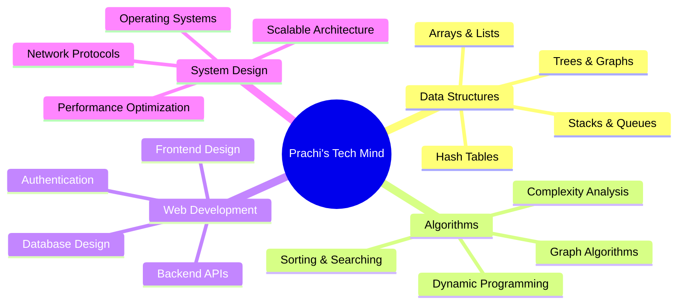

# 👋 Hello World! I'm **Prachi Jaiswal**

<div align="center">

[

](https://git.io/typing-svg)

</div>

----------

## 🎯 **About Me**

> _"Code is like humor. When you have to explain it, it's bad."_ – Cory House

I'm a **self-driven coder** who finds beauty in elegant algorithms and maintainable code. My journey is fueled by curiosity, powered by caffeine ☕, and driven by the endless pursuit of writing code that doesn't just work—but works beautifully.

```python
class PrachiJaiswal:
    def __init__(self):
        self.name = "Prachi Jaiswal"
        self.role = "Full Stack Developer"
        self.language_spoken = ["Hindi", "English"]
        self.code = ["Python", "JavaScript", "C++", "Java"]
        self.tools = ["VS Code", "Git", "Postman", "Node.js"]
        self.architecture = ["REST APIs", "Microservices", "MVC"]
        
    def say_hi(self):
        print("Thanks for dropping by! Let's build something amazing together 🚀")

me = PrachiJaiswal()
me.say_hi()

```

----------

## 🌟 **What Drives Me**

<table> <tr> <td width="33%" align="center">

### 🧠 **Problem Solving**

_Turning complex challenges into elegant solutions_


</td> <td width="33%" align="center">

### 🤝 **Collaboration**

_Building amazing things together_


</td> <td width="33%" align="center">

### 🚀 **Innovation**

_Always learning, always growing_


</td> </tr> </table>

----------

## 💼 **Leadership Spotlight**

<div align="center">

### 🎪 **Event Leadership Excellence**

```
┌─────────────────────────────────────────────────────────────┐
│  🎯 Led a team of 10+ members                               │
│  📊 Organized college event for 1,000+ attendees           │
│  🎤 Delivered impactful public presentations               │
│  ⚡ Coordinated complex logistics under tight deadlines     │
│  🏆 Achieved 100% event success rate                       │
└─────────────────────────────────────────────────────────────┘

```

_Transforming ideas into reality, one event at a time_ ✨

</div>

----------

## 🛠️ **Tech Arsenal**

<div align="center">

### **Programming Languages**

   

### **Web Development**

   

### **Tools & Technologies**

    

</div>

----------

## 🎓 **Core Expertise**

<div align="center">



</div>

----------

## 📊 **GitHub Analytics**

<div align="center">   </div> <div align="center">


</div>

----------

## 🎯 **Current Focus**

<table> <tr> <td>

```javascript
const currentGoals = {
    learning: [
        "Advanced System Design",
        "Cloud Computing (AWS/Azure)",
        "Machine Learning Basics",
        "Docker & Kubernetes"
    ],
    building: [
        "Personal Portfolio Website",
        "Open Source Contributions",
        "Full Stack Web Applications"
    ],
    contributing: [
        "Community Projects",
        "Technical Blog Writing",
        "Mentoring Juniors"
    ]
};

```

</td> </tr> </table>

----------

## 🌈 **Fun Facts About Me**

<div align="center">

🎯

**Fact**

🔥

I debug with `console.log()` and I'm not ashamed!

⚡

Can turn coffee into code at 3 AM

🎨

Love designing with Canva in my free time

📚

Always have 5+ programming books in my reading queue

🤖

Dream of contributing to AI/ML projects someday

🎵

Code better with lo-fi music playing in background

</div>

----------

## 🤝 **Let's Connect & Collaborate!**

<div align="center">

### _"Great things are built by great teams"_

<br/>

[](https://www.linkedin.com/in/prachi-jaiswal-142b75278/) [](https://github.com/jaiswalprachi19) [](mailto:jaiswalprachi19@gmail.com)

<br/>

```
┌─────────────────────────────────────────────────────────────┐
│  💡 Open to:                                                │
│  • Open Source Collaborations                              │
│  • Interesting Project Discussions                         │
│  • Learning & Knowledge Exchange                           │
│  • Mentorship Opportunities                                │
│  • Tech Community Contributions                            │
└─────────────────────────────────────────────────────────────┘

```

### 📧 **Drop me a line:** `jaiswalprachi19@gmail.com`

</div>

----------

<div align="center">

### 🌟 **"Code with passion, build with purpose"** 🌟

----------

⭐ **If you find my work interesting, don't forget to star my repositories!** ⭐

</div>
